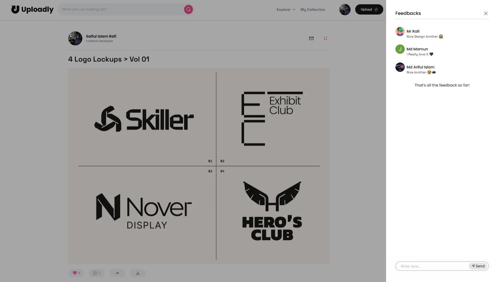
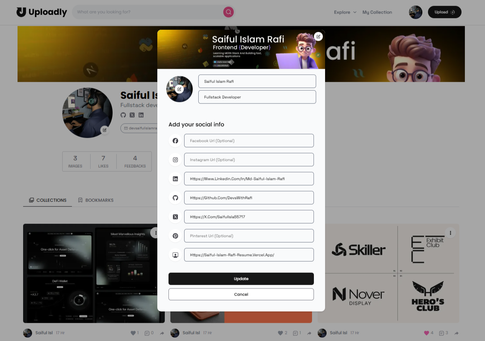

# Uploadly

Full-stack NextTs image sharing platform where users can upload, manage, and interact with images. The platform includes editing and deletion controls, social engagement tools (likes, comments, shares, bookmarks), and customizable user profiles.

#### Live Demo: https://uploadly-nu.vercel.app

<table>
  <tr>
    <td></td>
    <td></td>
  </tr>
  <tr>
    <td></td>
    <td></td>
  </tr>
</table>

## **Key Features**

### 🔐 Authentication & User Management

-   Secure authentication powered by `Clerk`
-   Complete profile customization (bio, name, social links)
-   Custom profile and cover photo uploads
-   User profile pages with image collections

### 📤 Image Upload & Management

-   Drag-and-drop image upload with `React Dropzone`
-   Cloud storage via `Cloudinary` API
-   Rich metadata support (title, description, category)
-   Edit and update image details post-upload
-   Delete images from your collection

### 🎨 Social Features

-   Like images you love
-   Comment and engage in discussions
-   Share images across platforms
-   Bookmark favorites for later viewing
-   View other users' profiles and collections

## **🛠️ Tech Stack**

### Frontend

  <table>
  <tr>
    <td><strong>Next.js 16</strong></td>
    <td>React framework with App Router</td>
  </tr>
  <tr>
    <td><strong>TypeScript</strong></td>
    <td>Type-safe development</td>
  </tr>
  <tr>
    <td><strong>Tailwind CSS</strong></td>
    <td>Utility-first styling</td>
  </tr>
  <tr>
    <td><strong>Shadcn UI</strong></td>
    <td>Reusable component library</td>
  </tr>
  <tr>
    <td><strong>React Hot Toast</strong></td>
    <td>Elegant notifications</td>
  </tr>
</table>

### Backend & Database

<table>
  <tr>
    <td><strong>Prisma ORM</strong></td>
    <td>Type-safe database client</td>
  </tr>
  <tr>
    <td><strong>PostgreSQL (Neon)</strong></td>
    <td>Serverless Postgres database</td>
  </tr>
  <tr>
    <td><strong>Server Actions</strong></td>
    <td>Modern data mutations</td>
  </tr>
  <tr>
    <td><strong>API Routes</strong></td>
    <td>Server-side data fetching</td>
  </tr>
</table>

### Third-Party Services

<table>
  <tr>
    <td><strong>Clerk</strong></td>
    <td>Authentication & user management</td>
  </tr>
  <tr>
    <td><strong>Cloudinary</strong></td>
    <td>Image hosting & optimization</td>
  </tr>
  <tr>
    <td><strong>React Dropzone</strong></td>
    <td>File upload interface</td>
  </tr>
</table>

## **Installation**

### 1. Installation

```bash
# clone repo
git clone https://github.com/devsWithRafi/Uploadly.git
# go to the folder
cd uploadly
```

### 2. Install dependencies

```bash
npm install
```

### 3. Set up environment variables

```bash
create .env file in the root/src folder
```

#### Add your credentials:

```env
# clerck api key
NEXT_PUBLIC_CLERK_PUBLISHABLE_KEY="YOUR_KEY"
CLERK_SECRET_KEY="YOUR_KEY"
CLERK_WEBHOOK_SIGNING_SECRET="YOUR_KEY"

NEXT_PUBLIC_CLERK_SIGN_IN_URL="/signin"
NEXT_PUBLIC_CLERK_SIGN_UP_URL="/signup"

# Optional: Fallback redirects
CLERK_SIGN_IN_FALLBACK_REDIRECT_URL="/"
CLERK_SIGN_UP_FALLBACK_REDIRECT_URL="/signin"

# cludinary
CLOUD_NAME="YOUR_CLOUD_NAME"
CLOUD_API_KEY="YOUR_CLOUD_API_KEY"
CLOUD_API_SECRET="YOUR_CLOUD_API_SECRET"
CLOUDINARY_URL="cloudinary://YOUR_CLOUDINARY_URL"

# database url
DATABASE_URL="postgresql://<user>:<password>@localhost:5432/<database>?schema=public"
```

### 4. Run database migrations

```bash
npx prisma generate
npx prisma db push
```

### 5. Start the development server

```bash
npm run dev
```

## 🤝 Contributing
#### Contributions are welcome! Please feel free to submit a Pull Request.


## 👨‍💻 Author
### Saiful Islam Rafi

- **GitHub**: @devsWithRafi
- **LinkedIn**: https://www.linkedin.com/in/saiful-islam-rafi-6705602a6/
- **Portfolio**: https://saiful-islam-rafi-resume.vercel.app/

---

<div align="center"> Made with ❤️ and ☕
⭐ Star this repo if you find it helpful!

</div>

---
